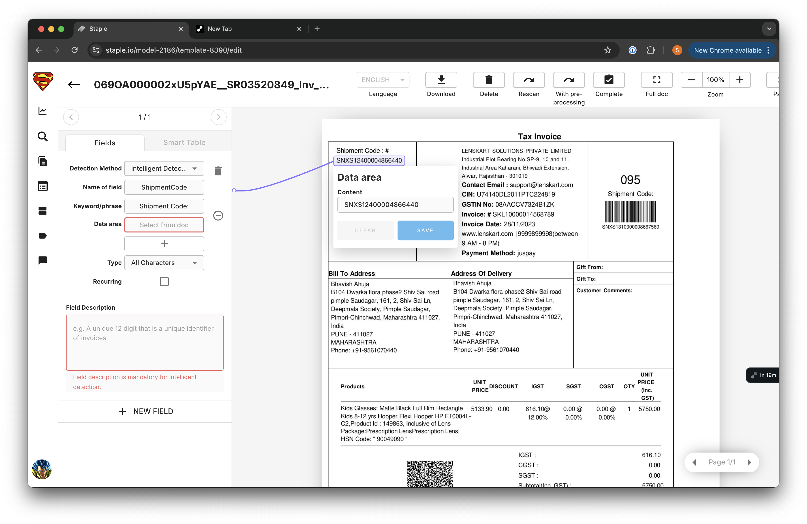

# GeminiGalaxy

## Description

Galaxy focus on creating custom templates and help you extract information through intelligent `Gemini` Models. Galaxy also helps you capture tables detected in your template.

Each galaxy model contains multiple templates. The number of fields to be extracted within a model are same. However, each template can have different fields to be extracted.

## Steps To Use Galaxy

### Step 1: 

Login to [staple.io](https://staple.io/login)

Please contact [josh\@staple.io](mailto:josh@staple.io) for creating an account.

### Step 2: Create Galaxy Model

Create a galaxy model.

A model creation page will pop up. Give your model a name. Select image type and choose if you want document translation while tagging.

Select the image processing preferences you want for your model. 

Now, since you have created a model.

Upload your document.

Once your document is uploaded clicked on your document. And select the detection method.

`Detection Methods`: Detection methods are of two types: 

1. Positional Based: Where we use the spatial information to extract information.
2. Intelligence Based: Where we leverage Gemini 1.5-Pro to extract information.
   

After selecting a detection method. You need to add Name of the field, ie. field to be extracted. You will also need to
tag keywords and data_area.

Once you have tagged the keywords and data_area, If you have selected `intelligence based` extraction, you must add a description for your field. This will help Gemini understand what to extract.

Now you must select the field `data_type` which best describes your field value.

Once you have tagged all the fields that you want to extract, click on complete on the task bar to register your custom template.

## Step3: Upload a Scan

Create a new queue

Add the details for your queue. Select your custom model that you have just created.

Add image pre-processing preferences for your documents. 

Now, upload the document that you want to scan

Once documents are scanned, your scanned document should look like this, with the extracted values.

Here are the values mapped in the document.

## Contact Us

For any queries, contact [josh\@staple.io](mailto:josh@staple.io)
